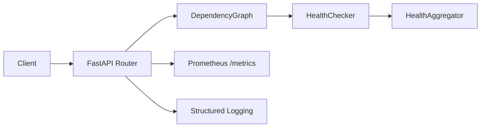

# System Health Check API

A production-oriented Google Cloud Platform Engineering / AI SRE take-home assignment that evaluates the health of interconnected services represented as a Directed Acyclic Graph (DAG).

## Executive Summary

This project delivers a FastAPI-based REST API that validates dependency graphs, traverses them with Breadth First Search, executes asynchronous health checks, aggregates results, and exposes Prometheus metrics for operational visibility. The application is designed for Google Cloud Run and deployed with Terraform and GitHub Actions.

## Problem Statement

Build a service that accepts a dependency graph, validates it, executes health checks across the dependency tree, and returns a reliable system health response with production-grade observability and developer experience.

## Solution Overview

The API receives a `HealthCheckRequest`, builds and validates the DAG, discovers root nodes, traverses each dependency tree with BFS, resolves node IDs into component objects, performs concurrent HTTP health checks, aggregates component health, and returns a `HealthCheckResponse`.

## Architecture



## Technology Stack

- Python 3.12
- FastAPI
- Pydantic v2
- NetworkX
- asyncio
- httpx
- tabulate
- prometheus_client
- Docker
- Terraform
- Google Cloud Run
- Artifact Registry
- GitHub Actions

## Project Structure

- `app/` - API, domain models, graph engine, health checker, aggregation, metrics, and logging
- `tests/` - pytest unit and API tests
- `terraform/` - Google Cloud provider, Cloud Run, and Artifact Registry configuration
- `scripts/` - bootstrap helper
- `examples/` - sample request payloads
- `docs/` - design decisions and supporting documentation

## Assumptions

- Incoming graphs must be valid DAGs.
- Health checks are request-scoped and stateless.
- Cloud Run is the target runtime.
- Google-managed services are preferred over self-managed infrastructure.
- Persistence, retries, and distributed state are intentionally out of scope for the assignment.

## Features Implemented

- FastAPI REST API
- DAG validation and BFS traversal
- Concurrent asynchronous health checks
- Health aggregation and summary output
- Structured logging
- Prometheus metrics endpoint
- Docker image build
- Terraform deployment for Cloud Run and Artifact Registry
- GitHub Actions CI
- Unit and endpoint tests

## Features Intentionally Excluded

- Authentication and authorization
- Database persistence
- GKE or self-managed Kubernetes
- VPC and Cloud SQL
- Retry policies and circuit breakers
- Distributed caching
- Multi-region deployment
- OpenTelemetry implementation
- AI-driven root cause analysis

## Design Decisions

- **FastAPI** for async-native request handling and Pydantic integration.
- **NetworkX** for DAG validation and traversal.
- **asyncio + httpx.AsyncClient** for concurrent component checks.
- **tabulate** for a human-readable component table.
- **Prometheus metrics** for request and health-check observability.
- **Cloud Run + Artifact Registry** for a managed, low-ops deployment model.
- **Terraform** for repeatable infrastructure provisioning.
- **GitHub Actions** for CI automation.

## Tradeoffs

- In-memory aggregation keeps the service simple but does not retain history.
- A single-region Cloud Run deployment reduces operational overhead but limits regional redundancy.
- The implementation favors clarity and maintainability over advanced resiliency patterns such as retries or circuit breakers.

## Observability

- **Structured Logging** with a `component` field for application logs
- **Prometheus Metrics** exposed at `/metrics`
- Counters: `api_requests_total`, `health_checks_total`
- Histograms: `api_request_duration_seconds`, `health_check_duration_seconds`
- Gauges: `healthy_components`, `unhealthy_components`
- Cloud Run compatible stdout logging for centralized collection

## AI Usage

GitHub Copilot was used for boilerplate implementation, refactoring, and unit tests.

ChatGPT was used for architecture reviews, documentation, Terraform review, CI/CD review, design tradeoffs, and code review guidance.

All AI-generated code was manually reviewed, tested, modified where appropriate, and fully understood before being committed.

## Developer Experience

- `make bootstrap` - create the virtual environment, install dependencies, and initialize local configuration
- `make run` - start the API locally with Uvicorn
- `make test` - run the test suite
- `make docker` - build the container image

The bootstrap script targets Python 3.12 and creates `.env` from `.env.example` when needed.

## Local Development

```bash
make bootstrap
source .venv/bin/activate
make run
```

Useful commands:

```bash
make test
make docker
```

## Testing

The repository uses pytest for unit and API tests. Coverage includes DAG validation, health checking, aggregation, metrics exposure, and FastAPI endpoint behavior.

## Docker

Build the container image locally:

```bash
make docker
```

Run the container:

```bash
docker run --rm -p 8080:8080 system-health-check-api
```

## Terraform Deployment

Terraform provisions the Google Cloud resources required for deployment:

- Google provider configured from `project_id` and `region`
- Artifact Registry Docker repository
- Cloud Run service
- Public Cloud Run access for unauthenticated requests

Apply the infrastructure from the `terraform/` directory:

```bash
cd terraform
terraform init
terraform plan
terraform apply
```

Outputs include the Cloud Run URL and the Artifact Registry repository name.

## CI/CD Pipeline

GitHub Actions runs the automated CI workflow on push and pull request events. The pipeline installs dependencies, runs `ruff`, runs `pytest`, and builds the Docker image. This keeps the repository reviewable and production-ready without adding deployment automation.

## Future Enhancements

- Retries with exponential backoff
- Circuit breaker support
- Distributed tracing with OpenTelemetry
- Cloud Monitoring dashboards and alerting
- Optional DAG visualization
- Historical persistence for health trends
- Additional policy controls for production hardening
