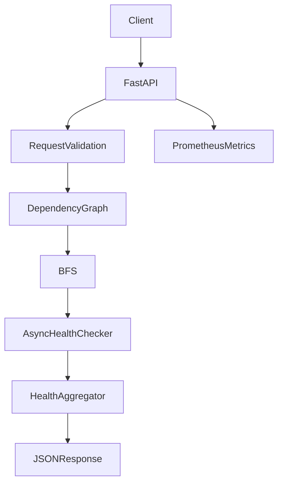
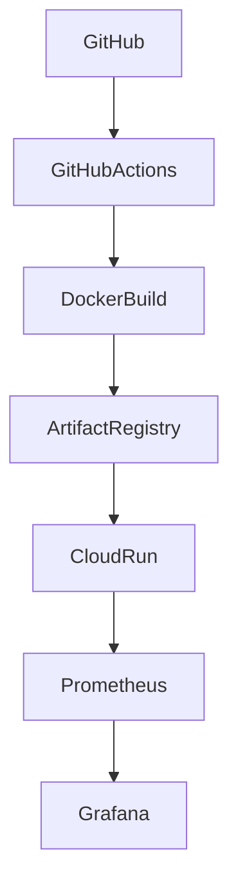

# System Health Check API

A production-oriented FastAPI service that evaluates the health of multiple interdependent components represented as a **Directed Acyclic Graph (DAG)**.

This project was developed as a take-home assignment for a **Senior Google Cloud Platform Engineering / AI SRE** role and demonstrates modern application development, Infrastructure as Code, observability, and cloud deployment practices.

---

# Highlights

- ✅ FastAPI REST API
- ✅ DAG validation using NetworkX
- ✅ Breadth-First Search (BFS) traversal
- ✅ Asynchronous health checks using asyncio + httpx
- ✅ Prometheus metrics
- ✅ Structured logging
- ✅ Docker containerization
- ✅ Terraform infrastructure
- ✅ Google Cloud Run deployment
- ✅ Artifact Registry integration
- ✅ GitHub Actions CI/CD
- ✅ Grafana dashboard
- ✅ Local Prometheus + Grafana monitoring stack
- ✅ Unit tests with pytest


# Assignment Goals

This implementation addresses the requested deliverables by providing:

- Python-based FastAPI application
- DAG construction and validation
- Breadth-First Search (BFS) traversal
- Asynchronous component health evaluation
- Aggregated system health response
- Infrastructure as Code using Terraform
- Docker containerization
- GitHub Actions CI pipeline
- Prometheus metrics
- Grafana dashboards
- Cloud Run deployment
- Comprehensive documentation covering assumptions, design decisions, tradeoffs, and future enhancements

# Problem Statement

Build an API that accepts a Directed Acyclic Graph (DAG) describing dependent system components, evaluates the health of each component asynchronously, and returns an aggregated health summary suitable for operational use.

# Solution Overview

The application performs the following workflow:

1. Validate the incoming request.
2. Construct a dependency graph.
3. Verify the graph is a valid DAG.
4. Discover root nodes.
5. Traverse the graph using Breadth-First Search (BFS).
6. Execute asynchronous health checks.
7. Aggregate component health.
8. Return a concise system health summary.

# Features Implemented

- DAG construction and validation
- Cycle detection
- Breadth-First Search traversal
- Concurrent HTTP health checks
- Aggregated health response
- Structured logging
- Prometheus metrics
- Health, readiness, and liveness endpoints
- Docker support
- Terraform deployment to Google Cloud Run
- Local Prometheus and Grafana monitoring
- Unit test coverage

# Intentionally Out of Scope

The following capabilities were intentionally excluded to keep the implementation focused on the assignment:

- Authentication and authorization
- Persistent storage
- Historical health reporting
- Retry policies
- Circuit breakers
- Distributed tracing
- Service discovery
- Background scheduling
- Multi-region deployment
- AI-assisted remediation


# Architecture



Infrastructure



More detailed architecture diagrams are available in:

```
docs/architecture.md
```

# Technology Stack

| Layer | Technology |
|--------|------------|
| API | FastAPI |
| Validation | Pydantic |
| Graph Processing | NetworkX |
| Concurrency | asyncio |
| HTTP Client | httpx |
| Observability | Prometheus |
| Logging | Python Logging |
| Container | Docker |
| Infrastructure | Terraform |
| Cloud | Google Cloud Run |
| Registry | Artifact Registry |
| CI/CD | GitHub Actions |


# Repository Structure

```
app/            Application source
tests/          Unit tests
terraform/      Infrastructure as Code
monitoring/     Prometheus + Grafana stack
grafana/        Dashboard JSON
docs/           Project documentation
examples/       Sample requests
scripts/        Helper scripts
```

# API Endpoints

| Endpoint | Description |
|----------|-------------|
| `POST /health-check` | Evaluate system component health |
| `GET /health` | Health endpoint |
| `GET /live` | Liveness probe |
| `GET /ready` | Readiness probe |
| `GET /metrics` | Prometheus metrics |
| `GET /docs` | Swagger UI |


# Quick Start

```bash
git clone <repository-url>

cd system-health-check-api

python -m venv .venv

source .venv/bin/activate

pip install -r requirements.txt

uvicorn app.main:app --reload
```

Open:

```
http://localhost:8080/docs
```
---
# Running Locally

## Install dependencies

```bash
python -m venv .venv

source .venv/bin/activate

pip install -r requirements.txt
```

## Start the application

```bash
uvicorn app.main:app --reload --port 8080
```

Open

```
http://localhost:8080/docs
```

---

# Example Request

```bash
curl -X POST \
http://localhost:8080/health-check \
-H "Content-Type: application/json" \
-d @examples/sample_request.json
```

---

# Testing

Run all unit tests

```bash
pytest -v
```

Static analysis

```bash
ruff check .
```

---

# Docker

Build

```bash
docker build -t system-health-check-api .
```

Run

```bash
docker run --rm -p 8080:8080 system-health-check-api
```

---

# Terraform Deployment

```bash
cd terraform

terraform init

terraform validate

terraform plan

terraform apply
```

Destroy

```bash
terraform destroy
```

---

# Monitoring

The repository includes a complete local monitoring stack.

Start monitoring

```bash
cd monitoring

docker compose up -d
```

Services

| Service | URL |
|----------|-----|
| Grafana | http://localhost:3000 |
| Prometheus | http://localhost:9090 |

Generate traffic

```bash
for i in {1..50}; do
curl -s http://localhost:8080/health-check \
-H "Content-Type: application/json" \
-d @../examples/sample_request.json >/dev/null
done
```

---

# Cloud Deployment

Infrastructure is provisioned using Terraform.

Deployment target:

- Google Cloud Run
- Artifact Registry
- Public HTTPS endpoint

Container images are built with Docker and pushed to Artifact Registry before deployment.


# Observability

The application exposes:

- Structured logs
- `/health`
- `/live`
- `/ready`
- `/metrics`

Prometheus metrics include:

- API request count
- API latency
- Health check duration
- Healthy components
- Unhealthy components

The Grafana dashboard visualizes:

- Request rate
- Average latency
- P95 latency
- Component health
- Error ratio

# Additional Documentation

Additional documentation is available in:

- `docs/architecture.md`
- `docs/design-decisions.md`
- `docs/platform-considerations.md`
- `docs/demo-guide.md`

# Assignment Goals

This implementation addresses the requested deliverables by providing:

- Python-based FastAPI application
- DAG construction and validation
- Breadth-First Search (BFS) traversal
- Asynchronous component health evaluation
- Aggregated system health response
- Infrastructure as Code using Terraform
- Docker containerization
- GitHub Actions CI pipeline
- Prometheus metrics
- Grafana dashboards
- Cloud Run deployment
- Comprehensive documentation covering assumptions, design decisions, tradeoffs, and future enhancements

# Tradeoffs

- Cloud Run minimizes operational overhead compared to Kubernetes.
- In-memory aggregation simplifies the implementation but does not retain historical state.
- BFS provides a clear dependency traversal strategy suitable for this use case.

# AI Usage

AI tools were used to accelerate development while maintaining engineering ownership.

**GitHub Copilot**

- Boilerplate generation
- Refactoring
- Unit tests

**ChatGPT**

- Architecture review
- Platform engineering review
- Terraform review
- Observability review
- Documentation refinement
- Code review guidance

All AI-generated suggestions were manually reviewed, validated, tested, and modified where appropriate before being committed.

# Future Enhancements

- Retry policies
- Circuit breakers
- OpenTelemetry
- Cloud Trace
- Google Cloud Monitoring dashboards
- SLOs / SLIs / Error Budgets
- Vertex AI-assisted incident analysis
- AI-generated operational runbooks
- Multi-region deployment

# License

This project is provided for demonstration and evaluation purposes as part of a technical assessment.