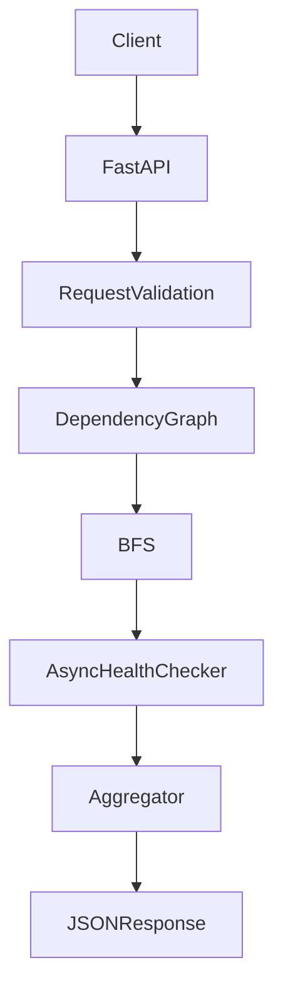
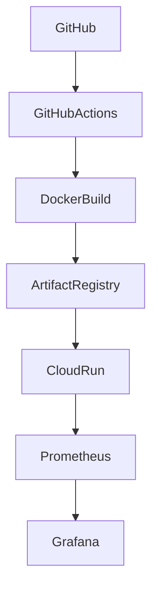

# Architecture

## Application Architecture

The application is intentionally thin at the API layer. FastAPI handles request routing and validation, while the graph, checker, and aggregator components own the domain logic.

## Infrastructure Architecture

GitHub Actions provides repeatable CI. Terraform provisions the Google Cloud resources. Docker packages the application for Cloud Run. Grafana visualizes Prometheus metrics from the application.

## Why Cloud Run Instead of Kubernetes

Cloud Run was selected because the workload is a stateless HTTP API with a small operational footprint. It provides managed autoscaling, simpler deployment, and lower maintenance overhead than Kubernetes.

Kubernetes would add cluster lifecycle management, networking complexity, and more operational surface area without improving the goals of this assignment.

## Why Terraform Manages Infrastructure

Terraform keeps the deployment reproducible and reviewable. The infrastructure is small, mostly static, and well suited to declarative management.

Using Terraform also makes it clear which Google Cloud resources are required and keeps the submission aligned with infrastructure-as-code practices expected in platform engineering.

## Why Prometheus Metrics Were Chosen

Prometheus is a lightweight, widely understood metrics model for API throughput, latency, and dependency health.

It fits the application’s stateless design, integrates cleanly with Grafana, and provides the operational signals needed for a take-home assignment without adding unnecessary complexity.
